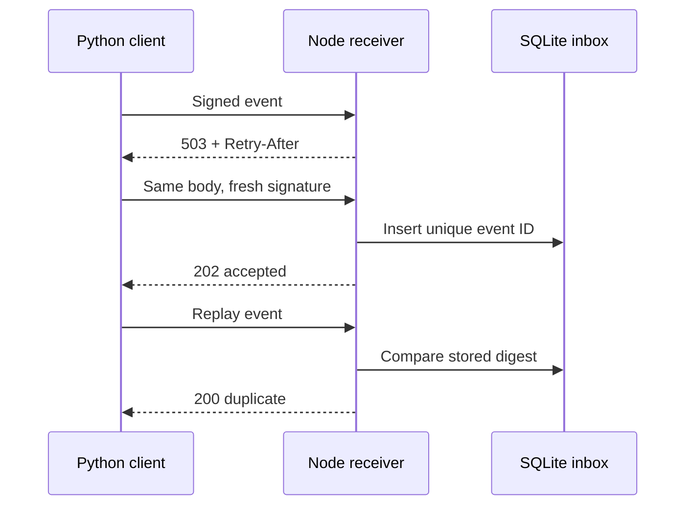

# Webhook Reliability Lab

[](https://github.com/grantmaye/Webhook-Reliability-Lab/actions/workflows/ci.yml)

**A Node.js event receiver and Python delivery client that exercise failure recovery together.**

The receiver checks HMAC signatures and timestamp freshness before storing an event in SQLite. The Python client retries temporary failures with exponential backoff and jitter, respects `Retry-After`, and treats permanent errors as final. Event IDs make repeated deliveries safe for the inbox.

Independent personal portfolio project using synthetic orders. No provider accounts, live purchases, external credentials or employer code are involved.

## One-command demo

Requires **Node.js 24.x and Python 3.11+** on your PATH. No third-party runtime packages are required.

```sh
python3 scripts/demo.py
```

The demo creates a temporary secret and database, starts Node on an available localhost port, and runs real Python HTTP requests:

1. The receiver returns two deliberate `503` failures.
2. Python retries, succeeding on attempt three.
3. A second event is accepted.
4. Both events are replayed and acknowledged as duplicates.
5. A reused ID with altered content receives `409` and is not retried.
6. Python checks the diagnostic endpoint **and** the SQLite table: exactly two events are saved.

The demo then stops Node and removes its temporary database.

```json
{
  "verified": true,
  "stats": {
    "attempts": 7,
    "accepted": 2,
    "duplicates": 2,
    "transient_failures": 2,
    "stored_events": 2
  }
}
```

## What it demonstrates

**Node.js:** HTTP servers, raw request bodies, HMAC verification, timing-safe comparison, timestamp validation, SQL transactions, durable idempotency, and concurrent HTTP tests.

**Python:** typed delivery results, HTTP clients, dependency injection for deterministic tests, exception handling, retry classification, backoff, subprocess orchestration and cross-language integration testing.



## Run tests

```sh
npm test
python3 -m unittest discover -s tests -v
python3 scripts/demo.py
```

Tests cover stale/future signatures, changed bodies, malformed requests, body limits, persistent deduplication after reopening, concurrent duplicate requests, permanent versus retryable statuses, network failures, retry budgets, refreshed timestamps, and `Retry-After` handling.

The CI workflow runs both language suites and the complete demo. See the linked CI workflow for the latest hosted test results.

## Run the receiver and client separately

Use the same shell environment so both processes receive the same secret:

```sh
export WEBHOOK_SECRET="$(node -e 'process.stdout.write(require("node:crypto").randomBytes(32).toString("hex"))')"
npm start &
```

Wait for the JSON `listening` message, then:

```sh
python3 -m sender --events examples/events.json
python3 -m sender --events examples/events.json
curl -s http://127.0.0.1:3001/stats -H "Authorization: Bearer $WEBHOOK_SECRET"
```

The second delivery should return `duplicate: true`. Use `fg` and Ctrl+C to stop the server. On Windows, use two terminals with the same environment values.

| Variable | Default | Purpose |
| --- | --- | --- |
| `WEBHOOK_SECRET` | Required | Random shared secret, at least 32 characters |
| `PORT` | `3001` | `0` chooses an available port |
| `DB_PATH` | `./data/inbox.sqlite` | Persistent inbox |
| `DEMO_FAIL_FIRST` | `0` | Inject 0–10 temporary failures after signature and schema validation |

Python options: `--url`, `--events`, and `--attempts` (1–8, default 4). Exit codes: `0` all delivered, `1` at least one failed delivery, `2` bad configuration/input. Each event prints a JSON outcome without the secret or event body.

## Wire contract

`POST /webhooks/orders` accepts JSON up to 64 KiB:

```json
{
  "id": "evt_1001",
  "type": "order.created",
  "data": { "order_id": "ORD1001", "amount_cents": 12999, "currency": "USD" }
}
```

Headers:

- `X-Webhook-Timestamp`: Unix time in seconds, accepted within 300 seconds in either direction.
- `X-Webhook-Signature`: lowercase hex HMAC-SHA256 of `timestamp + "." + raw_body`, using the shared secret.
- `Content-Type: application/json`.

ID and order ID accept 1–100 letters, digits, underscores and hyphens. Amount is a nonnegative safe integer in cents. This lab supports `order.created` in USD only.

| Status | Meaning | Client behavior |
| --- | --- | --- |
| `202` | New event persisted | Success |
| `200` | Identical event already persisted | Success |
| `400/401/409/413/415/422` | Invalid input, signature, or conflicting ID | Stop |
| `408/429/500/502/503/504` | Potentially temporary failure | Retry within the attempt budget |
| Network timeout/failure | Outcome may be unknown | Retry the same event |

The client keeps event bytes stable between attempts but signs a fresh timestamp. By default its wait is `min(0.5 × 2^(attempt−1), 10)` seconds plus 0–0.25 seconds of jitter. A valid `Retry-After` overrides that delay; a value above 60 seconds stops the local harness with `retry_after_exceeds_budget` rather than retrying early. HTTP redirects are not followed.

## Important design boundaries

- This is an **idempotent inbox**, not exactly-once business processing. A later worker needs its own transaction/outbox strategy for fulfillment or other side effects.
- Deduplication compares raw body hashes. Different byte serialization under the same ID is a conflict, even if the JSON is semantically equivalent. The bundled sender serializes consistently.
- Event rows survive restarts. Attempt metrics are process-local and reset on restart; attempts count requests that pass both signature and schema validation, including conflicts.
- The receiver listens only on localhost. The diagnostic `/stats` endpoint reuses the development secret as a bearer credential; production should use a separate administrative identity.
- There is no persistent client retry queue, secret rotation, TLS termination, rate limiting, payload encryption, retention policy or provider-specific signing adapter. Test with synthetic data.
- SQLite calls are synchronous; a high-throughput receiver needs a concurrency and storage design appropriate to its load.

See [EXERCISES.md](EXERCISES.md) for extensions that turn the lab into your own engineering story.

References: [Node crypto](https://nodejs.org/docs/latest-v24.x/api/crypto.html), [Python hmac](https://docs.python.org/3/library/hmac.html), [Python urllib](https://docs.python.org/3/library/urllib.request.html).
